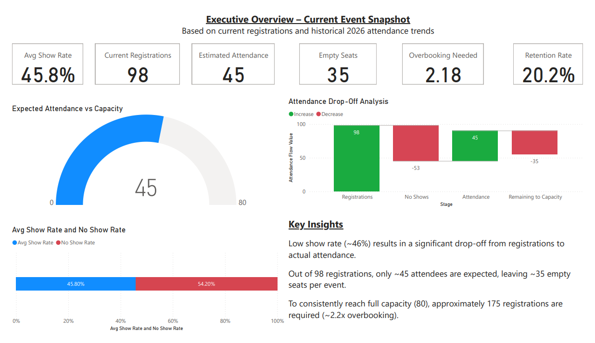
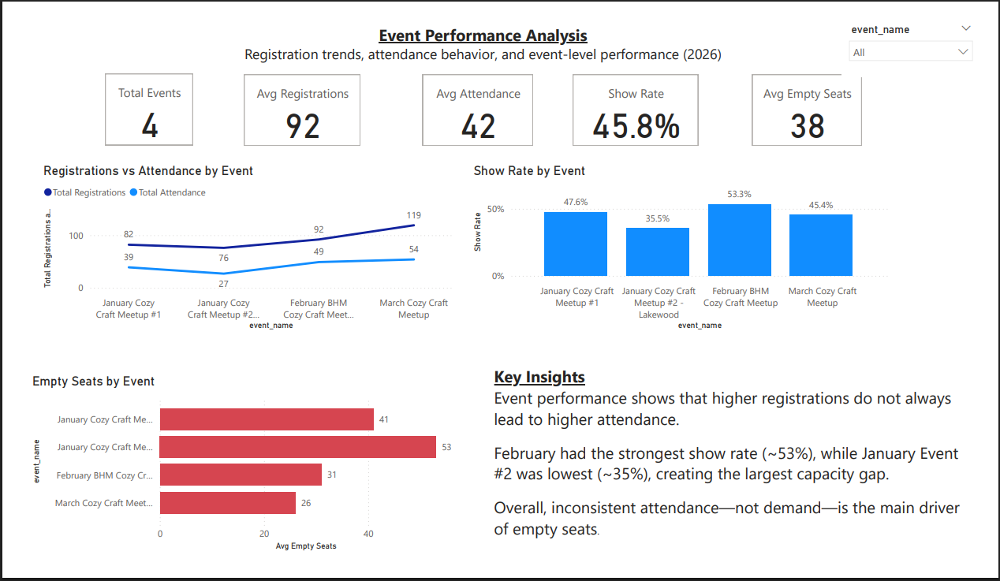
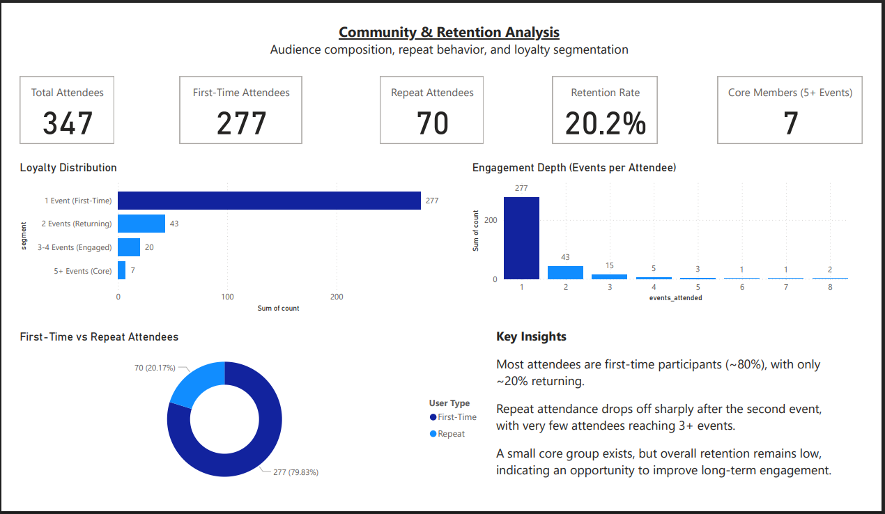
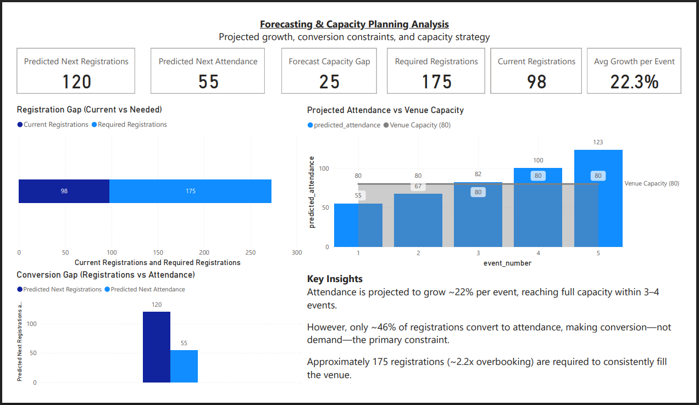

# Denver Cozy Craft Collective — Event Analytics & Forecasting

End-to-end data analytics and business intelligence solution using SQL, Python (Jupyter Notebook), and Power BI to analyze event performance, optimize attendance conversion, and forecast capacity planning strategies.

---

## 📑 Table of Contents

* [Project Overview](#-project-overview)
* [Business Problem](#-business-problem)
* [Project Objectives](#-project-objectives)
* [Data Pipeline](#-end-to-end-data-pipeline)
* [Key Insights](#-key-insights)
* [Dashboard Preview](#-dashboard-preview)
* [Tools & Technologies](#-tools--technologies)
* [Core Skills Demonstrated](#-core-skills-demonstrated)
* [Business Impact](#-business-impact)
* [Repository Structure](#-repository-structure)
* [Data Validation](#-data-validation)
* [Conclusion](#-conclusion)

---

## 📌 Project Overview

This project transforms raw event data (orders, attendees, and check-ins) into a structured analytics system that supports decision-making around attendance, growth, and community engagement.

The workflow follows a full analytics lifecycle:

**PostgreSQL (ETL & Data Warehouse) → Python (EDA & Modeling) → Power BI (Visualization & Insights)**

---

## 🎯 Business Problem

Despite increasing registrations, events consistently failed to reach full capacity due to low attendance conversion.

This project addresses:

- Attendance inefficiency (registrations vs actual attendees)
- Ticket release strategy optimization
- Community retention and engagement
- Forecasting future event performance

---

## 🎯 Project Objectives

- Improve attendance conversion from registrations to actual attendees  
- Identify patterns in customer retention and repeat engagement  
- Develop a forecasting model for event capacity planning  
- Design a scalable analytics pipeline for ongoing business use
  
---

## 🏗️ End-to-End Data Pipeline

### 🔹 1. SQL — ETL & Data Warehousing (PostgreSQL)

- Extracted raw CSV data into relational tables
- Performed data cleaning and validation
- Built transformation layer for KPI generation
- Designed a **dimensional model (star schema)**:

  - **Fact Table:** `fact_event_performance`
  - **Dimension Tables:** `dim_event`, `dim_attendees`

- Created reusable analytical tables:
  - Event summaries
  - Attendance KPIs
  - Customer loyalty segmentation

📌 **Concepts Applied:**
- ETL pipeline development  
- Data cleaning & transformation  
- Dimensional modeling  
- Star schema design  
- Data warehousing  
- SQL aggregation & joins  

---

### 🔹 2. Python — EDA, KPI Engineering & Forecasting (Jupyter Notebook)

- Performed **Exploratory Data Analysis (EDA)** to identify patterns in attendance behavior
- Engineered key metrics:
  - Show rate (~46%)
  - No-show rate (~54%)
  - Retention rate (~20%)
- Built growth model (~22% per event)
- Developed forecasting logic using:
  - Historical growth trends  
  - Attendance conversion rates  
- Calculated:
  - Capacity gaps  
  - Required registrations (~2.2x overbooking)

- Exported clean datasets for BI layer

📌 **Concepts Applied:**
- Exploratory Data Analysis (EDA)  
- Feature engineering  
- KPI development  
- Predictive analytics / forecasting  
- Data transformation (pandas)  
- Analytical modeling  

---

### 🔹 3. Power BI — Business Intelligence & Visualization

Developed a 4-page executive dashboard:

1. **Executive Overview (Current Event Snapshot)**
2. **Event Performance Analysis**
3. **Retention & Engagement Analysis**
4. **Forecasting & Capacity Planning**

- Built KPI cards and analytical visuals
- Translated model outputs into business insights
- Designed for stakeholder decision-making

📌 **Concepts Applied:**
- Business Intelligence (BI)  
- Data visualization  
- Dashboard design  
- KPI reporting  
- Data storytelling  

---

## 📊 Key Insights

### Attendance Efficiency
- Only **~46% of registrants attend events**
- No-shows (~54%) are the primary cause of empty seats

### Capacity Optimization
- To reach **80 attendees**, approximately:
  - **~175 registrations are required**
  - (~2.2x overbooking strategy)

### Growth Trend
- Registrations growing at **~22% per event**
- Full capacity projected within **3–4 future events**

### Community Retention
- **~80% of attendees are first-time participants**
- Only **~20% return**
- Limited core audience → retention opportunity

---

## 📈 Dashboard Preview

### Executive Overview


### Event Performance


### Retention Analysis


### Forecasting & Capacity Planning


---

## 🧰 Tools & Technologies

- **SQL (PostgreSQL)** — ETL, data modeling, warehousing  
- **Python (pandas, Jupyter Notebook)** — EDA, analytics, forecasting  
- **Power BI** — dashboards, visualization, reporting  

---

### Data Engineering & Analytics Framework

- ETL Pipeline: PostgreSQL → Python → Power BI  
- Data Warehouse Design: Star Schema (Fact & Dimension Tables)  
- Analytical Layer: KPI computation & forecasting models  
- Presentation Layer: Interactive BI dashboards  

---


## 🧠 Core Skills Demonstrated

- ETL Pipeline Development  
- Data Cleaning & Transformation  
- Data Warehousing & Dimensional Modeling  
- Exploratory Data Analysis (EDA)  
- Feature Engineering  
- KPI Development  
- Predictive Analytics & Forecasting  
- Customer Segmentation  
- Business Intelligence (BI)  
- Data Visualization & Storytelling  

---

## 💼 Business Impact

This project provides a scalable analytics framework that enables:

- Data-driven ticket release strategy  
- Improved attendance utilization  
- Identification of retention gaps  
- Forecasting-based planning for future events  

Applicable across:
- Event-based businesses  
- Membership communities  
- Subscription platforms  

---

## 📂 Repository Structure
```
cozy-craft-community-analytics/
│
├── data/        # Clean datasets (analysis-ready)
├── dashboard/   # Power BI files
├── images/      # Dashboard previews
├── notebooks/   # Python analysis & modeling
├── sql/         # ETL & data warehouse scripts
└── README.md
```

---

## ✅ Data Validation

- All KPIs computed programmatically  
- Validated against raw check-in data  
- No manual manipulation of results  
- Fully reproducible pipeline  

---

## 🚀 Conclusion

This project demonstrates a full-stack analytics workflow, converting raw operational data into actionable business insights.

By integrating data engineering, analytics, and visualization, it delivers a complete system for optimizing attendance, forecasting demand, and supporting long-term growth strategy.
